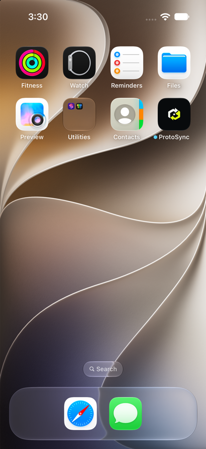

<p align="center">
  
</p>

<h1 align="center">ProtoSync</h1>

<p align="center">
  跨生态多设备联动:局域网点对点、端到端加密的剪贴板与文件同步<br>
  Local-first, end-to-end encrypted clipboard &amp; file sync across macOS · iOS · Android
</p>

<p align="center">
  
  
  
</p>

---

ProtoSync 让同一局域网内的设备**自动互相发现**,在两两之间建立**端到端加密**通道,同步剪贴板、收发文件——不经过任何服务器,数据只在你的设备之间流动。

```text
  DEVICE NODE ──verified route──> DEVICE NODE
```

## 功能

| | macOS | iOS | Android |
|---|---|---|---|
| 自动发现(Bonjour/mDNS) | ✅ | ✅ | ✅ |
| 设备配对(TOFU 指纹核对) | ✅ | ✅ | ✅ |
| 剪贴板同步(文本) | ✅ 自动 | ✅ 手动发送¹ | ✅ 手动发送¹ |
| 剪贴板同步(图片) | ✅ 自动 | ✅ 手动发送 | 🚧 计划中 |
| 文件收发(单文件,SHA-256 校验) | ✅ | ✅ | ✅ |
| 按设备设置文件自动接收(关闭后逐个确认) | ✅ | ✅ | ✅ |
| 跳过密码管理器复制的内容(Concealed/Transient) | ✅ | —² | —² |
| 后台保活 | ✅ 菜单栏常驻 | —(iOS 前台使用) | ✅ 前台服务 |
| 收到内容通知 | ✅ | ✅ | ✅ 横幅 + 一键复制 |
| 结构化活动流 / 收件箱 | ✅ | ✅ | ✅ |
| 菜单栏面板 / 单屏面板(拖文件到设备头像即发送) | ✅ | ✅ | ✅ |
| 剪贴板历史(仅内存,点按再次复制) | ✅ | ✅ | ✅ |

> ¹ Android 10+ / iOS 系统限制:剪贴板只能前台手动发送,接收自动。
> ² 这两端只支持手动发送剪贴板(用户明确操作),不自动读取。

## 截图

| iOS | macOS |
|---|---|
|  | *待补充* |

## 安全模型

- 每台设备持有两把静态 P256 密钥(签名 + ECDH),指纹 = `SHA256(signPub ‖ dhPub)`
- 握手:临时密钥三轮 ECDH(`eph×eph ‖ eph×static ‖ static×eph`)→ HKDF-256 → 会话密钥,前向安全
- 握手 transcript 绑定双方公钥与设备名;auth 签名带角色标签(防反射),协议版本随 hello 携带(当前 v2,版本不一致给出明确提示)
- 所有业务消息 ChaCha20-Poly1305 AEAD 加密,nonce 为方向独立单调计数器
- 配对采用 **TOFU + 6 位配对码**:两端由同一握手 transcript 推导出相同的码,发起方点“配对”即同意,接收方核对两块屏幕上的码一致后接受;中间人会导致两端的码不同
- 已配对设备默认免确认收文件;可按设备关闭,关闭后每个文件需手动接收(120 秒未处理自动拒绝)
- 剪贴板内容的哈希在接收端重新计算校验,与声明不符直接丢弃
- 协议为平台无关的二进制线协议(4 字节大端分帧 + JSON),Swift 与 Java 双实现真机互验

## 各端构建

### macOS(SwiftPM,Command Line Tools 即可)

```bash
swift build
swift run protosync-tests   # 单元测试
./scripts/make-app.sh       # 生成 ProtoSync.app(菜单栏应用)
```

### iOS(xcodegen + Xcode 15+)

```bash
cd ios && xcodegen generate
open ProtoSync.xcodeproj    # 选模拟器 ⌘R;真机部署见 docs/DEPLOY_TO_IPHONE.md
```

### Android(无 Gradle:javac + d8 + aapt2 + apksigner)

```bash
./android/build_apk.sh      # 需 JAVA_HOME + ANDROID_HOME(build-tools 35)
adb install -r android/build/ProtoSync-android.apk
```

## 仓库结构

```text
Sources/            Swift 协议栈(Core,平台无关)+ macOS App + CLI 测试对端 + 测试
ios/                iOS App(xcodegen 工程 + SwiftUI)
android/            Android 客户端(纯 Java,无 Gradle 工具链)
scripts/            图标生成 / macOS 打包脚本
docs/               平台前置条件调研、真机部署指南
docs/design/        设计规范(MENUBAR_PANEL.md 为当前方向)与 logo 资产
tools/              开发辅助(非发布产物):UI 设计沙盒、Compose 工具链冒烟测试
```

## 路线图

- [x] 6 位 SAS 配对码(两端从握手材料推导,防中间人)
- [ ] Android 剪贴板图片
- [ ] Windows 客户端
- [ ] HarmonyOS NEXT 客户端
- [ ] 蓝牙就近发现(无 Wi-Fi 场景)

## 设计

ProtoSync 是“需要时才出现”的工具:macOS 上主界面是菜单栏弹出面板,iOS 上是单屏面板——
一眼看到谁在线,拖一下就发送,需要你决定的事才会出现。深色外观、单一 Lime 强调色、系统字体。
详见 [docs/design/MENUBAR_PANEL.md](docs/design/MENUBAR_PANEL.md)。
早期的 Signal Foundry 方向保留在 [docs/design/PROTO_SYNC_VISUAL_DIRECTION.md](docs/design/PROTO_SYNC_VISUAL_DIRECTION.md),仅作历史参考。

## License

[MIT](LICENSE)
