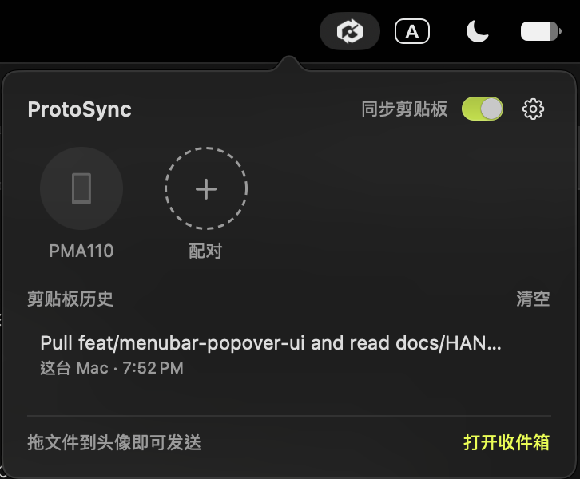
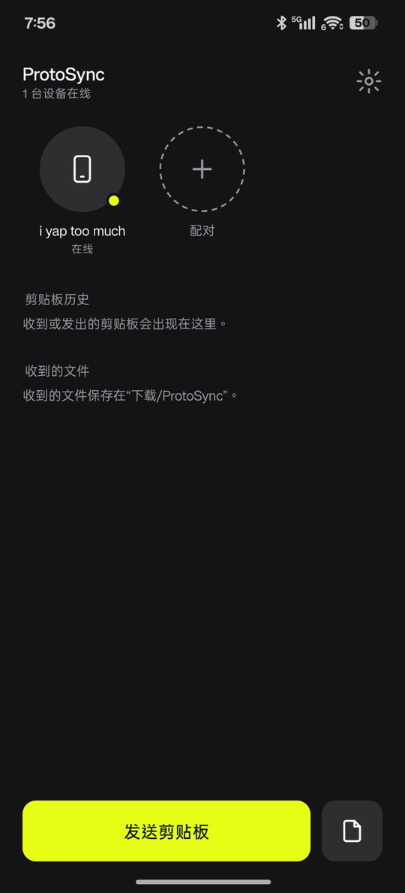
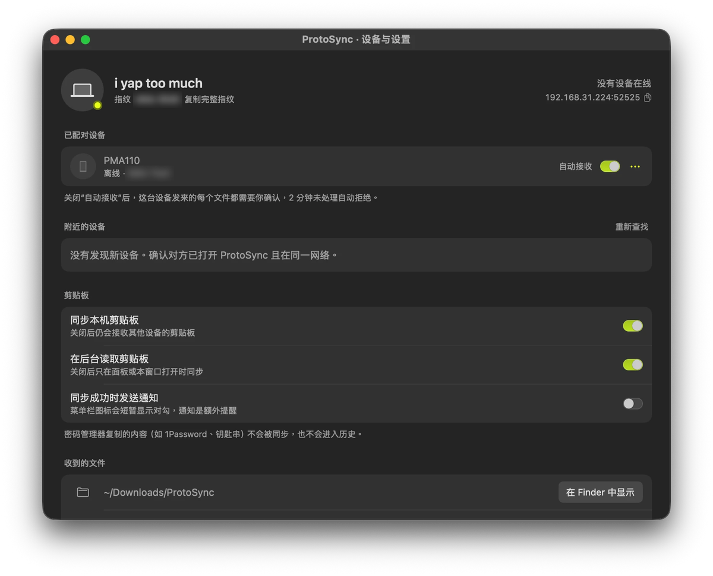
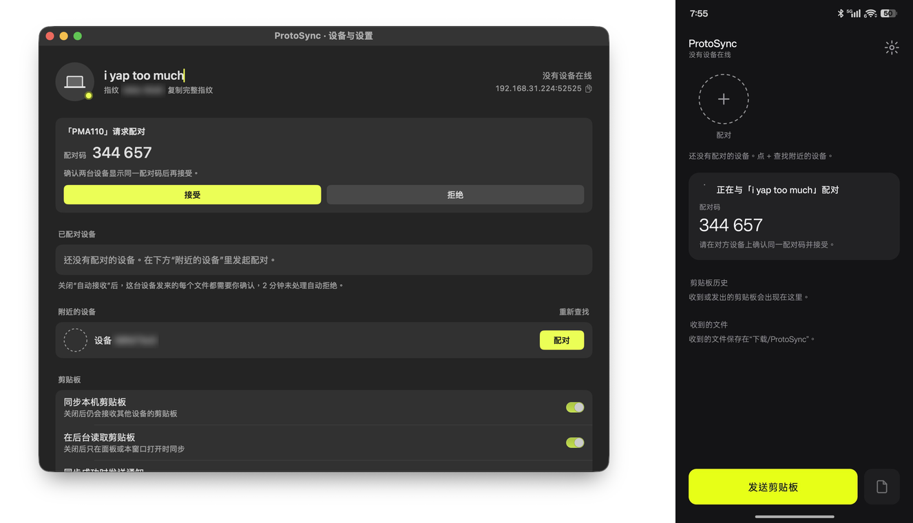

<p align="center">
  
</p>

<h1 align="center">ProtoSync</h1>

<p align="center">
  局域网点对点、端到端加密的剪贴板与文件同步<br>
  Local-first, end-to-end encrypted clipboard &amp; file sync across macOS · iOS · Android
</p>

<p align="center">
  <a href="https://github.com/1nduce337/protosync/releases/latest"></a>
  
  
  
</p>

---

ProtoSync 让同一局域网内的设备自动互相发现，在两两之间建立端到端加密的通道，同步剪贴板、收发文件。不经过任何服务器，数据只在你自己的设备之间流动。

它是一个“需要时才出现”的工具：Mac 上住在菜单栏里，一眼看到哪些设备在线，把文件拖到设备头像上就发出去了；只有需要你决定的事（配对、接收文件）才会弹到面前。

## 截图

<p align="center">
  
  &nbsp;&nbsp;
  
</p>

<p align="center">
  
</p>

<p align="center">
  
</p>

## 下载

从 [Releases](https://github.com/1nduce337/protosync/releases/latest) 下载最新版本：

| 平台 | 文件 | 系统要求 |
|---|---|---|
| macOS | `ProtoSync-<版本>-macOS.zip` | macOS 13 及以上 |
| Android | `ProtoSync-<版本>-android.apk` | Android 9 及以上 |
| iOS | 暂不提供安装包，需要从源码构建（见下文） | iOS 17 及以上 |

> **macOS 首次打开**：当前版本未经 Apple 公证，会被系统拦截。打开“系统设置 › 隐私与安全性”，在底部点“仍要打开”；或在终端运行 `xattr -dr com.apple.quarantine /Applications/ProtoSync.app`。系统询问“本地网络”权限时请选择允许。

## 快速开始

1. 两台设备连上同一个 Wi-Fi，都打开 ProtoSync。Mac 版只出现在菜单栏：左键打开面板，右键打开菜单。
2. 在其中一台设备上点 **＋ 配对**，在“附近的设备”里选中另一台。
3. 两台设备会显示**同一个 6 位配对码**。核对一致后，在另一台设备上点**接受**。
4. 配对完成：
   - **Mac**：复制即同步；把文件拖到设备头像上即可发送。
   - **Android / iOS**：点“发送剪贴板”发送当前剪贴板；收到的内容自动进入剪贴板；点设备头像选择文件发送。

配对过的设备之后会自动重连。

## 功能

| | macOS | iOS | Android |
|---|---|---|---|
| 自动发现（Bonjour / mDNS） | ✅ | ✅ | ✅ |
| 6 位配对码配对 | ✅ | ✅ | ✅ |
| 剪贴板同步：文本 | ✅ 复制即同步 | ✅ 手动发送¹ | ✅ 手动发送¹ |
| 剪贴板同步：图片 | ✅ 复制即同步 | ✅ 手动发送¹ | ✅ 手动发送¹ |
| 剪贴板历史（最近 6 条，仅内存，点按再次复制） | ✅ | ✅ | ✅ |
| 文件收发（SHA-256 校验） | ✅ 拖到头像 | ✅ | ✅ |
| 按设备设置“自动接收文件”（关闭后逐个确认） | ✅ | ✅ | ✅ |
| 跳过密码管理器复制的内容 | ✅ | —² | —² |
| 后台常驻 | ✅ 菜单栏 | — 前台使用 | ✅ 前台服务 |
| 收到内容时通知 | ✅ | ✅ | ✅ 横幅 + 一键复制 |

> ¹ iOS 与 Android 10+ 的系统限制：后台应用不能读取剪贴板，所以只能在前台手动发送；接收是自动的。<br>
> ² 这两端只在你点“发送剪贴板”时读取剪贴板，不会自动读取。

## 安全模型

- **设备身份**：每台设备持有两把静态 P-256 密钥（签名 + ECDH），指纹 = `SHA256(signPub ‖ dhPub)`。
- **握手**：临时密钥三轮 ECDH（`eph×eph ‖ eph×static ‖ static×eph`）→ HKDF-SHA256 → 会话密钥，前向安全。
  - transcript 绑定双方公钥与设备名，认证签名带角色标签（防反射）；
  - 协议版本随 hello 携带（当前 v2），版本不一致时给出明确提示。
- **加密**：所有业务消息使用 ChaCha20-Poly1305，nonce 为按方向独立的单调计数器。
- **配对**：TOFU + 6 位配对码。配对码由两端相同的握手 transcript 推导，只在本地计算、不经过网络；中间人会导致两端的码不同。发起方点“配对”即表示同意，只需另一端核对后接受；未完成的配对不会留下单方面记录。
- **文件**：已配对设备默认免确认收文件，可按设备关闭；关闭后每个文件需要手动接收，120 秒未处理自动拒绝。接收端校验文件名、大小与 SHA-256。
- **剪贴板**：接收端重新计算内容哈希，与声明不符直接丢弃；Mac 跳过密码管理器标记为隐藏或临时的内容。
- **线协议**：平台无关的二进制协议（4 字节大端分帧 + JSON），Swift 与 Java 两套独立实现逐字节对齐。

## 从源码构建

### macOS（SwiftPM，Command Line Tools 即可）

```bash
swift build
swift run protosync-tests          # 单元测试
./scripts/make-app.sh              # 生成 ProtoSync.app（菜单栏应用）
```

### iOS（xcodegen + Xcode 15+）

```bash
cd ios && xcodegen generate
open ProtoSync.xcodeproj           # 选模拟器 ⌘R；真机部署见 docs/DEPLOY_TO_IPHONE.md
```

### Android（无 Gradle：javac + d8 + aapt2 + apksigner）

```bash
./android/build_apk.sh             # 需要 JAVA_HOME 与 ANDROID_HOME（build-tools 35）
adb install -r android/build/ProtoSync-android.apk
```

### 打包发布

```bash
scripts/package-release.sh 0.0.1   # 跑测试，生成 dist/ 下的 macOS zip、Android APK 与 SHA-256
```

各版本的变化见 [CHANGELOG.md](CHANGELOG.md)。

## 仓库结构

```text
Sources/            Swift 协议栈（Core，平台无关）+ macOS 应用 + CLI 测试对端 + 测试
ios/                iOS 应用（xcodegen 工程 + SwiftUI）
android/            Android 客户端（纯 Java，无 Gradle）
scripts/            打包、发布与图标生成脚本
packaging/macos/    macOS 应用图标（由 scripts/make-app-icons.swift 生成）
docs/               发布说明、部署指南与设计规范
tools/              开发辅助（不随发布）：UI 设计沙盒、Compose 工具链测试
```

## 路线图

- [x] 6 位配对码（两端从握手推导，防中间人）
- [x] Android 剪贴板图片
- [ ] 身份密钥存入钥匙串 / Android Keystore
- [ ] 断点续传、多文件与文件夹传输
- [ ] iOS 分享扩展、Android 分享入口
- [ ] macOS 版公证（免去首次打开的拦截）
- [ ] Windows 客户端
- [ ] HarmonyOS NEXT 客户端
- [ ] 蓝牙就近发现（无 Wi-Fi 场景）

## 设计

深色外观、单一 Lime 强调色、系统字体：用填充分组代替描边，只在需要你决定时才出现卡片。
详见 [docs/design/MENUBAR_PANEL.md](docs/design/MENUBAR_PANEL.md)。
早期的 Signal Foundry 方向保留在 [docs/design/PROTO_SYNC_VISUAL_DIRECTION.md](docs/design/PROTO_SYNC_VISUAL_DIRECTION.md)，仅作历史参考。

## License

[MIT](LICENSE)
